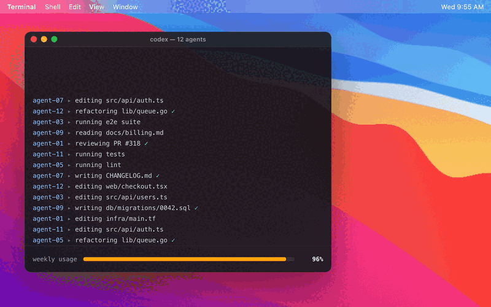

# limitless-codex

**Your Codex agents never stall at the weekly limit.** limitless-codex watches your usage and, at 99%, spends one of your reset credits for you, before the limit stops your agents.

<p align="center"></p>

## Install (macOS)

```bash
brew tap Comradery64/limitless-codex https://github.com/Comradery64/limitless-codex
brew install --HEAD limitless-codex
limitless-codex setup
```

`setup` opens a short guided window that walks you through:

1. **Codex:** confirms you're signed in, or signs you in.
2. **Notifications:** asks macOS for permission, so you hear about every reset.
3. **Background monitor:** starts it now and every time you log in.
4. **Test:** sends one notification to make sure it reaches you.

If a step needs a System Settings change, a button opens the exact pane, and a guide beside it points at the switch.

## How it works

1. Every 30 seconds, it asks Codex for your weekly usage and your available reset credits.
2. When usage reaches 99%, it spends one reset credit, and your limit starts over at 0%.
3. You get a notification: *"Usage hit 99%, rate limit reset (1 credit left)."*
4. It waits 5 minutes, then goes back to watching.

It only spends credits your plan already gives you. It can't create more. With no credits left, it notifies you once, and Codex stops at the limit as usual.

It talks to Codex through your own Codex CLI and sign-in. No passwords or keys are stored, and nothing is sent anywhere else.

## Notifications

| When | Message |
|------|---------|
| A reset worked | Usage hit 99%, rate limit reset (N credits left) |
| A reset failed | Reset failed at 99% usage: *error* |
| No credits left | Usage at 99% and no reset credits left |

## Settings

| Variable | Default | What it does |
|----------|---------|--------------|
| `THRESHOLD` | `99` | Usage percent that triggers a reset |
| `CODEX_BIN` | found on your `PATH` | Path to the `codex` CLI |

To change the threshold, edit the monitor's settings file and restart it:

```bash
PLIST=~/Library/LaunchAgents/io.github.comradery64.limitless-codex.plist
/usr/libexec/PlistBuddy -c "Set :EnvironmentVariables:THRESHOLD 98" $PLIST
launchctl bootout gui/$(id -u)/io.github.comradery64.limitless-codex; launchctl bootstrap gui/$(id -u) $PLIST
```

## Check on it

```bash
tail -f ~/Library/Logs/limitless-codex.log    # live log
limitless-codex --mode=status                 # usage right now, as JSON
limitless-codex setup                         # status window
```

The monitor uses about 39 MB of memory: about 7 MB for itself, plus the Codex connection it keeps open. Its CPU use is negligible.

## Troubleshooting

- **No notifications:** run `limitless-codex setup` and send a test from the Test step. If it doesn't appear, a Focus mode is probably hiding it, and setup shows you how to allow it.
- **"No rate limit data" in the log:** your Codex sign-in has expired. Run `codex login`.
- **A single `Error:` line in the log:** usually a brief network blip. The monitor retries every 30 seconds.

## Uninstall

```bash
launchctl bootout gui/$(id -u)/io.github.comradery64.limitless-codex
rm ~/Library/LaunchAgents/io.github.comradery64.limitless-codex.plist
brew uninstall limitless-codex
```

## Other ways to run it

- **From source (macOS):** `make install-app && limitless-codex setup`
- **Linux or a server:** `make build && make install`, then `limitless-codex --mode=daemon`
- **Shared hosting with no always-on machine:** HTTP mode plus `php-monitor.php` on a free cron service

See [DEPLOYMENT.md](DEPLOYMENT.md) for server and hosting setups.

## Build notes

The macOS app builds from source on your Mac with Command Line Tools and is signed locally. No Apple Developer account is involved, and Gatekeeper doesn't block it.

## License

MIT. Issues and PRs welcome at https://github.com/Comradery64/limitless-codex.

> **For Claude Code sessions:** read [NEXT-SESSION.md](NEXT-SESSION.md) for project status and [TODO.md](TODO.md) for remaining work.
